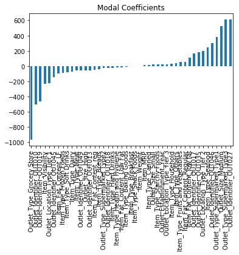
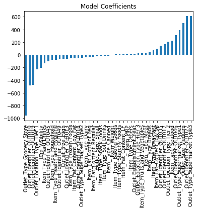
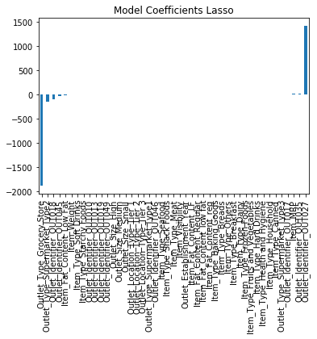

# Exploring Data


```python
#importing libraries
import pandas as pd
import numpy as np
from sklearn.model_selection import train_test_split
from sklearn.linear_model import LinearRegression
import matplotlib.pyplot as plt
```


```python
#including csv files
train = pd.read_csv("train.csv")
test = pd.read_csv("test.csv")
sample = pd.read_csv("sample.csv")
```


```python
train.head()
```


<div>
<table border="1" class="dataframe">
  <thead>
    <tr style="text-align: right;">
      <th></th>
      <th>Item_Identifier</th>
      <th>Item_Weight</th>
      <th>Item_Fat_Content</th>
      <th>Item_Visibility</th>
      <th>Item_Type</th>
      <th>Item_MRP</th>
      <th>Outlet_Identifier</th>
      <th>Outlet_Establishment_Year</th>
      <th>Outlet_Size</th>
      <th>Outlet_Location_Type</th>
      <th>Outlet_Type</th>
      <th>Item_Outlet_Sales</th>
    </tr>
  </thead>
  <tbody>
    <tr>
      <th>0</th>
      <td>FDA15</td>
      <td>9.30</td>
      <td>Low Fat</td>
      <td>0.016047</td>
      <td>Dairy</td>
      <td>249.8092</td>
      <td>OUT049</td>
      <td>1999</td>
      <td>Medium</td>
      <td>Tier 1</td>
      <td>Supermarket Type1</td>
      <td>3735.1380</td>
    </tr>
    <tr>
      <th>1</th>
      <td>DRC01</td>
      <td>5.92</td>
      <td>Regular</td>
      <td>0.019278</td>
      <td>Soft Drinks</td>
      <td>48.2692</td>
      <td>OUT018</td>
      <td>2009</td>
      <td>Medium</td>
      <td>Tier 3</td>
      <td>Supermarket Type2</td>
      <td>443.4228</td>
    </tr>
    <tr>
      <th>2</th>
      <td>FDN15</td>
      <td>17.50</td>
      <td>Low Fat</td>
      <td>0.016760</td>
      <td>Meat</td>
      <td>141.6180</td>
      <td>OUT049</td>
      <td>1999</td>
      <td>Medium</td>
      <td>Tier 1</td>
      <td>Supermarket Type1</td>
      <td>2097.2700</td>
    </tr>
    <tr>
      <th>3</th>
      <td>FDX07</td>
      <td>19.20</td>
      <td>Regular</td>
      <td>0.000000</td>
      <td>Fruits and Vegetables</td>
      <td>182.0950</td>
      <td>OUT010</td>
      <td>1998</td>
      <td>NaN</td>
      <td>Tier 3</td>
      <td>Grocery Store</td>
      <td>732.3800</td>
    </tr>
    <tr>
      <th>4</th>
      <td>NCD19</td>
      <td>8.93</td>
      <td>Low Fat</td>
      <td>0.000000</td>
      <td>Household</td>
      <td>53.8614</td>
      <td>OUT013</td>
      <td>1987</td>
      <td>High</td>
      <td>Tier 3</td>
      <td>Supermarket Type1</td>
      <td>994.7052</td>
    </tr>
  </tbody>
</table>
</div>


```python
#Checking the format of sample submission
sample.head()
```


<div>
<table border="1" class="dataframe">
  <thead>
    <tr style="text-align: right;">
      <th></th>
      <th>Item_Identifier</th>
      <th>Outlet_Identifier</th>
      <th>Item_Outlet_Sales</th>
    </tr>
  </thead>
  <tbody>
    <tr>
      <th>0</th>
      <td>FDW58</td>
      <td>OUT049</td>
      <td>NaN</td>
    </tr>
    <tr>
      <th>1</th>
      <td>FDW14</td>
      <td>OUT017</td>
      <td>NaN</td>
    </tr>
    <tr>
      <th>2</th>
      <td>NCN55</td>
      <td>OUT010</td>
      <td>NaN</td>
    </tr>
    <tr>
      <th>3</th>
      <td>FDQ58</td>
      <td>OUT017</td>
      <td>NaN</td>
    </tr>
    <tr>
      <th>4</th>
      <td>FDY38</td>
      <td>OUT027</td>
      <td>NaN</td>
    </tr>
  </tbody>
</table>
</div>


# Model 1- Mean (error : 1773.82514)


```python
#create a submission of mean
mean = train.Item_Outlet_Sales.mean()
outdf = test.loc[:,["Item_Identifier","Outlet_Identifier"]]
outdf["Item_Outlet_Sales"] = pd.Series([mean]*test.size)
```


```python
#check if mean is inserted properly
outdf.sample(5)
```


<div>
<table border="1" class="dataframe">
  <thead>
    <tr style="text-align: right;">
      <th></th>
      <th>Item_Identifier</th>
      <th>Outlet_Identifier</th>
      <th>Item_Outlet_Sales</th>
    </tr>
  </thead>
  <tbody>
    <tr>
      <th>5098</th>
      <td>FDS14</td>
      <td>OUT019</td>
      <td>2181.288914</td>
    </tr>
    <tr>
      <th>1054</th>
      <td>FDM32</td>
      <td>OUT049</td>
      <td>2181.288914</td>
    </tr>
    <tr>
      <th>4691</th>
      <td>FDA14</td>
      <td>OUT035</td>
      <td>2181.288914</td>
    </tr>
    <tr>
      <th>3206</th>
      <td>FDC51</td>
      <td>OUT010</td>
      <td>2181.288914</td>
    </tr>
    <tr>
      <th>1876</th>
      <td>FDM28</td>
      <td>OUT027</td>
      <td>2181.288914</td>
    </tr>
  </tbody>
</table>
</div>


```python
#submission file
outdf.to_csv("sub.csv")
```

# Model 2- Mean by Location ( error:1764.55199 )


```python
#find distribution of stores location wise
train.Outlet_Location_Type.value_counts()
```


    Tier 3    3350
    Tier 2    2785
    Tier 1    2388
    Name: Outlet_Location_Type, dtype: int64


```python
#calculate mean location wise
train_by_location = train.groupby("Outlet_Location_Type")
train_by_location.Item_Outlet_Sales.mean()
```


    Outlet_Location_Type
    Tier 1    1876.909159
    Tier 2    2323.990559
    Tier 3    2279.627651
    Name: Item_Outlet_Sales, dtype: float64


```python
#set location wise mean
def set_mean(location):
    if location == "Tier 1":
        return 1876.909159
    elif location == "Tier 2":
        return 2323.990559
    else:
        return 2279.627651
outdf = test.loc[:,["Item_Identifier","Outlet_Identifier"]]
outdf["Item_Outlet_Sales"] = test.Outlet_Location_Type.apply(lambda x: set_mean(x))
```


```python
outdf.sample(5)
```


<div>
<table border="1" class="dataframe">
  <thead>
    <tr style="text-align: right;">
      <th></th>
      <th>Item_Identifier</th>
      <th>Outlet_Identifier</th>
      <th>Item_Outlet_Sales</th>
    </tr>
  </thead>
  <tbody>
    <tr>
      <th>2778</th>
      <td>FDX03</td>
      <td>OUT018</td>
      <td>2279.627651</td>
    </tr>
    <tr>
      <th>4764</th>
      <td>NCQ30</td>
      <td>OUT035</td>
      <td>2323.990559</td>
    </tr>
    <tr>
      <th>5425</th>
      <td>FDT44</td>
      <td>OUT027</td>
      <td>2279.627651</td>
    </tr>
    <tr>
      <th>3841</th>
      <td>FDC33</td>
      <td>OUT017</td>
      <td>2323.990559</td>
    </tr>
    <tr>
      <th>4281</th>
      <td>FDM14</td>
      <td>OUT049</td>
      <td>1876.909159</td>
    </tr>
  </tbody>
</table>
</div>


```python
#write to submission csv
outdf.to_csv("sub.csv")
```

# Model 3-Linear Regression ( error: 1478.034674 )

## Creating Cross Validation


```python
#spitting data for cross validation
X = train.loc[:,["Outlet_Establishment_Year", "Item_MRP", "Item_Weight"]]
x_train, x_cv, y_train, y_cv = train_test_split(X, train.Item_Outlet_Sales)
```


```python
#Impute missing values 
mean_wieght = x_train.Item_Weight.mean()
x_train.Item_Weight = x_train.Item_Weight.fillna(mean_wieght)


mean_wieght = x_cv.Item_Weight.mean()
x_cv.Item_Weight = x_cv.Item_Weight.fillna(mean_wieght)
```


```python
#Building Model and making prediction
lreg = LinearRegression()
lreg = lreg.fit(x_train, y_train)
pred = lreg.predict(x_cv)
```


```python
#calculating mse
mse = np.mean((pred-y_cv)**2)
print mse
```

    1924655.65273


## Creating Submission


```python
#Impute missing values 
mean_wieght = train.Item_Weight.mean()
train.Item_Weight = train.Item_Weight.fillna(mean_wieght)

mean_wieght = test.Item_Weight.mean()
test.Item_Weight = test.Item_Weight.fillna(mean_wieght)
```


```python
#Build the model on complete train and make prediction
features = ["Outlet_Establishment_Year","Item_MRP", "Item_Weight"]
lreg = LinearRegression()
lreg = lreg.fit(train.loc[:, features],train.loc[:,"Item_Outlet_Sales"])
pred = lreg.predict(test.loc[:,features])
```


```python
#create submission file
outdf = test.loc[:,["Item_Identifier","Outlet_Identifier"]]
outdf["Item_Outlet_Sales"] = pred
outdf.to_csv("sub.csv")
```


```python
#checking coefficients
lreg.coef_
```


    array([-10.60176611,  15.56217307,  -1.18753875])


```python
#R-square
lreg.score(train.loc[:,features],train.Item_Outlet_Sales)
```


    0.32485181521300688


# Model 4 - Linear Regression with variable treatment and all features ( error: 1203.650456 )


```python
#including csv files
train = pd.read_csv("train.csv")
test = pd.read_csv("test.csv")
sample = pd.read_csv("sample.csv")

```


```python
train.describe()
```


<div>
<table border="1" class="dataframe">
  <thead>
    <tr style="text-align: right;">
      <th></th>
      <th>Item_Weight</th>
      <th>Item_Visibility</th>
      <th>Item_MRP</th>
      <th>Outlet_Establishment_Year</th>
      <th>Item_Outlet_Sales</th>
    </tr>
  </thead>
  <tbody>
    <tr>
      <th>count</th>
      <td>7060.000000</td>
      <td>8523.000000</td>
      <td>8523.000000</td>
      <td>8523.000000</td>
      <td>8523.000000</td>
    </tr>
    <tr>
      <th>mean</th>
      <td>12.857645</td>
      <td>0.066132</td>
      <td>140.992782</td>
      <td>1997.831867</td>
      <td>2181.288914</td>
    </tr>
    <tr>
      <th>std</th>
      <td>4.643456</td>
      <td>0.051598</td>
      <td>62.275067</td>
      <td>8.371760</td>
      <td>1706.499616</td>
    </tr>
    <tr>
      <th>min</th>
      <td>4.555000</td>
      <td>0.000000</td>
      <td>31.290000</td>
      <td>1985.000000</td>
      <td>33.290000</td>
    </tr>
    <tr>
      <th>25%</th>
      <td>8.773750</td>
      <td>0.026989</td>
      <td>93.826500</td>
      <td>1987.000000</td>
      <td>834.247400</td>
    </tr>
    <tr>
      <th>50%</th>
      <td>12.600000</td>
      <td>0.053931</td>
      <td>143.012800</td>
      <td>1999.000000</td>
      <td>1794.331000</td>
    </tr>
    <tr>
      <th>75%</th>
      <td>16.850000</td>
      <td>0.094585</td>
      <td>185.643700</td>
      <td>2004.000000</td>
      <td>3101.296400</td>
    </tr>
    <tr>
      <th>max</th>
      <td>21.350000</td>
      <td>0.328391</td>
      <td>266.888400</td>
      <td>2009.000000</td>
      <td>13086.964800</td>
    </tr>
  </tbody>
</table>
</div>


### Feature Engineering


```python
#Impute missing values
train.Item_Visibility.replace(0,train.Item_Visibility.mean(), inplace=True)
train.Item_Weight.fillna(train.Item_Weight.mean(), inplace=True)

test.Item_Visibility.replace(0,test.Item_Visibility.mean(), inplace=True)
test.Item_Weight.fillna(test.Item_Weight.mean(), inplace=True)

#Find How old is an outlet
train.Outlet_Establishment_Year = 2013-train.Outlet_Establishment_Year
test.Outlet_Establishment_Year = 2013-test.Outlet_Establishment_Year

test_ids = test.Item_Identifier
test_outlet_ids = test.Outlet_Identifier
```


```python
#find categorical variables
cat_list = list(train.select_dtypes(include=['object']).columns)
for i in cat_list:
    print train[i].describe()
cat_list.remove("Item_Identifier")
```

    count      8523
    unique     1559
    top       FDW13
    freq         10
    Name: Item_Identifier, dtype: object
    count        8523
    unique          5
    top       Low Fat
    freq         5089
    Name: Item_Fat_Content, dtype: object
    count                      8523
    unique                       16
    top       Fruits and Vegetables
    freq                       1232
    Name: Item_Type, dtype: object
    count       8523
    unique        10
    top       OUT027
    freq         935
    Name: Outlet_Identifier, dtype: object
    count       6113
    unique         3
    top       Medium
    freq        2793
    Name: Outlet_Size, dtype: object
    count       8523
    unique         3
    top       Tier 3
    freq        3350
    Name: Outlet_Location_Type, dtype: object
    count                  8523
    unique                    4
    top       Supermarket Type1
    freq                   5577
    Name: Outlet_Type, dtype: object


```python
#One Hot Encode all categorical
dummies = pd.get_dummies(train[cat_list], prefix=cat_list)
train.drop(cat_list, axis=1, inplace=True)
train = pd.concat([train,dummies], axis=1)

dummies = pd.get_dummies(test[cat_list], prefix=cat_list)
test.drop(cat_list, axis=1, inplace=True)
test = pd.concat([test,dummies], axis=1)
```

### Cross Validation


```python
#Creating CV set
X = train.drop(["Item_Outlet_Sales","Item_Identifier"], axis = 1)
x_train, x_cv, y_train, y_cv = train_test_split(X, train.Item_Outlet_Sales, test_size = 0.3)
```


```python
#Build Linear Regression Model
lreg = LinearRegression()
lreg = lreg.fit(x_train, y_train)
pred_cv = lreg.predict(x_cv)
```

    /usr/local/lib/python2.7/site-packages/scipy/linalg/basic.py:884: RuntimeWarning: internal gelsd driver lwork query error, required iwork dimension not returned. This is likely the result of LAPACK bug 0038, fixed in LAPACK 3.2.2 (released July 21, 2010). Falling back to 'gelss' driver.
      warnings.warn(mesg, RuntimeWarning)


```python
mse = np.mean((pred_cv-y_cv)**2)
print mse
```

    1333498.30156


```python
x_plot = plt.scatter(pred_cv, (pred_cv - y_cv), c='b')
plt.hlines(y=0, xmin= -1000, xmax=5000)
plt.title("Residual Plots")
plt.show()
```


```python
predictors = x_train.columns
coef = pd.Series(lreg.coef_,predictors).sort_values()
coef.plot(kind='bar', title='Modal Coefficients')
plt.show()

```





### Submission


```python
y = train.Item_Outlet_Sales
x = train.drop(["Item_Outlet_Sales","Item_Identifier"], axis=1)
test = test.drop("Item_Identifier", axis=1)
```


```python
#Build Linear Regression Model
lreg = LinearRegression()
lreg = lreg.fit(x, y)
pred = lreg.predict(test)
```


```python
outdf = pd.DataFrame({"Item_Identifier":test_ids,"Outlet_Identifier":test_outlet_ids,"Item_Outlet_Sales":pred})
```


```python
outdf.to_csv("sub.csv")
```

# Model 5 - Ridge Regression ( error:1203.65078 )

### Cross Validation


```python
#Build Model
from sklearn.linear_model import Ridge

rreg = Ridge()
rreg = rreg.fit(x_train, y_train)
pred_cv = rreg.predict(x_cv)
```


```python
mse = np.mean((pred_cv-y_cv)**2)
print mse
```

    1279694.66923


```python
#Plot Coefficients
predictors  = x_train.columns
coef = pd.Series(rreg.coef_,predictors).sort_values()
coef.plot(kind="bar",title="Model Coefficients")
plt.show()
```





### Submission


```python
#Build Model
from sklearn.linear_model import Ridge

#was getting better score without alpha and normalize
rreg = Ridge()
rreg = rreg.fit(x, y)
pred = rreg.predict(test)
```


```python
outdf = pd.DataFrame({"Item_Identifier":test_ids,"Outlet_Identifier":test_outlet_ids,"Item_Outlet_Sales":pred})
```


```python
outdf.to_csv("sub.csv")
```

# Model 6 - Lasso Regression ( error: 1202.92859 )

### Cross Validation


```python
#Build Model
from sklearn.linear_model import Lasso

lasReg = Lasso(alpha=0.3, normalize=True)
lasReg = lasReg.fit(x_train,y_train)
pred_cv = lasReg.predict(x_cv)
```


```python
mse = np.mean((pred_cv-y_cv)**2)
mse
```


    1275470.0722051396


```python
predictors = x_train.columns
coef = pd.Series(lasReg.coef_,predictors).sort_values()
coef.plot(kind="bar",title="Model Coefficients Lasso")
plt.show()
```





### Submission


```python
lasReg = Lasso()
lasReg = lasReg.fit(x,y)
pred = lasReg.predict(test)
```


```python
outdf = pd.DataFrame({"Item_Identifier":test_ids,"Outlet_Identifier":test_outlet_ids,"Item_Outlet_Sales":pred})
```


```python
outdf.to_csv("sub.csv")
```


```python

```


```python

```
